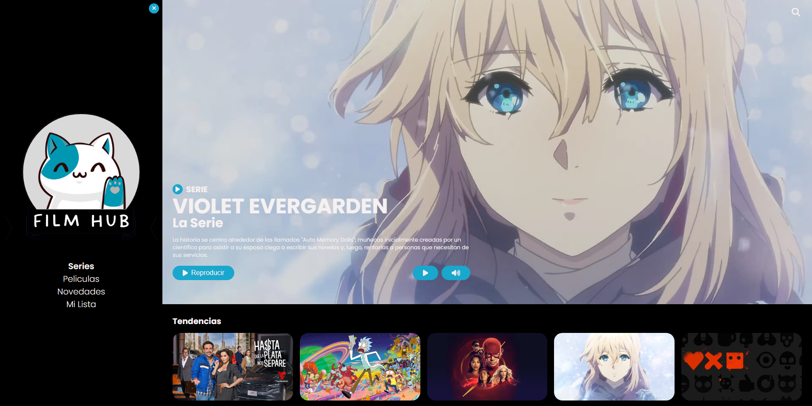
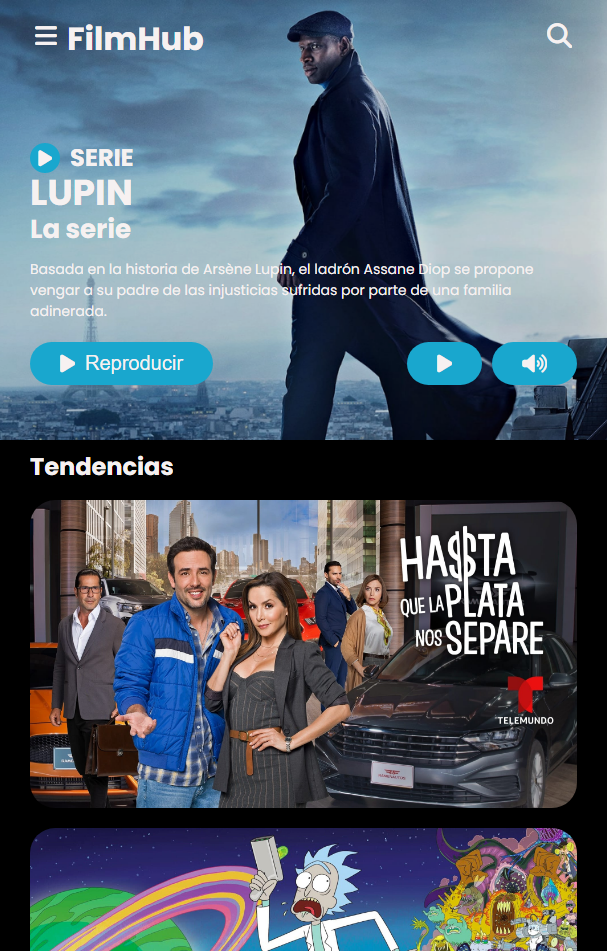

<h1 align="center">Mini Netflix</h1>

Elaborar una interfaz similar a Netflix utilizando HTML5

## Miembros del equipo:

|Nº|    Responsabilidad        | Nombres                          |
|--|---------------------------|----------------------------------|
|1 | Diseño y elaboración      |Llapapasca Montes, Ronal James    |
|2 | Elegir la paleta de color |Romero Collazos, Juan Bladimir    |
|3 | Elaboración del logo      |Vasquez Villegas, Kevin Jeferson  |

## Demo
[Github Pages](https://jamesllm.github.io/mini-netflix/)

## Screenshots

<h3>Escritorio</h3>

<h3>Mobil</h3>

### To do's

- [x] Video en la parte superior de la pagina
  - [x] Boton de muted / volumen
  - [x] Boton para pausar / reproducir video 
- Almacenamiento de videos
  - [x] Local
  - [x] Dropbox
- Almacenamiento de imagenes
  - [x] Local
  - [ ] Sitio externo
- [x] Boton para buscar en la pagina
  - [ ] Funcionamiento de este mismo
- [ ] Switch para cambiar entre tema oscuro y claro
- [x] Guardar en localStorage las preferencias del Sidenav 
- [x] Modal para visualizar el trailer de cada pelicula o serie
  - [x] Al dar click fuera del modal, este se cierra
- [ ] Guardar en un Array la lista de series/peliculas que le gustan y mostrarlos en la pagina **Mi Lista**
- [ ] Consumir la data a traves de una API o una base de datos
- [x] Responsive design